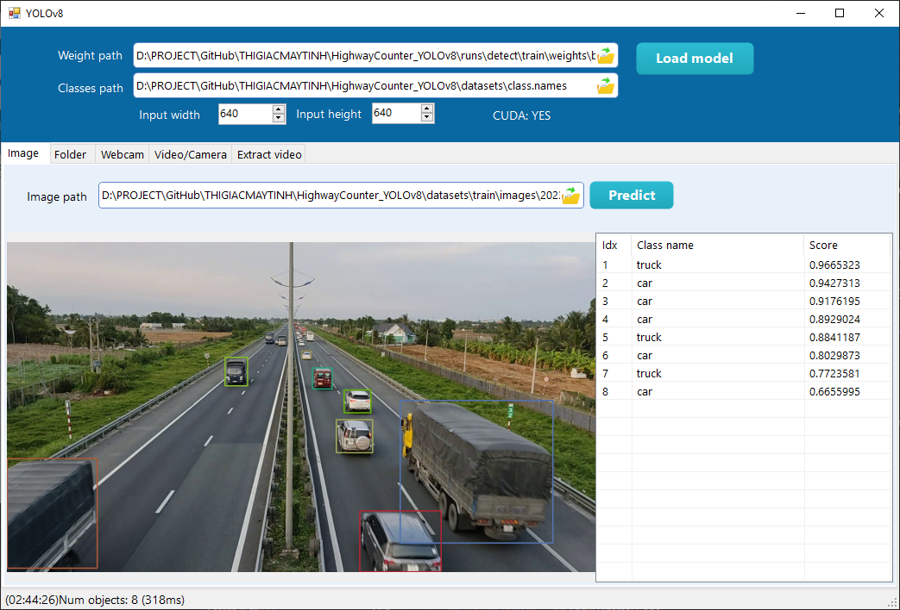

# HighwayCounter_YOLOv8



*Test bằng chương trình YOLOLYTIC*

## Yêu Cầu
Cài đặt Python 3.8.10

## Clone source code
```bash
git clone https://github.com/thigiacmaytinh/HighwayCounter_YOLOv8.git
cd HighwayCounter_YOLOv8 
```

##  Cài đặt các packages cần thiết
```bash
pip install -r requirements.txt
```

## Train
Huấn luyện mô hình YOLOv8 trên tập dữ liệu bằng lệnh:

```bash
yolo train model=yolov8n.pt data='./datasets/data.yaml' batch=32 epochs=300 imgsz=640 device=0
```

## Val
Sau khi huấn luyện, kiểm tra hiệu suất của mô hình bằng lệnh:

```bash
yolo val model='./runs/detect/train/weights/best.pt' data='./datasets/data.yaml'
```

## Detect
Để phát hiện phương tiện trong video, sử dụng lệnh:
```bash
yolo predict model='./runs/detect/train/weights/best.pt' source='bike_car.mp4' device=0
```

### Export
Để xuất mô hình đã huấn luyện sang định dạng ONNX, sử dụng lệnh:
```bash
yolo export model='./runs/detect/train/weights/best.pt' imgsz=640,640 format=onnx opset=12 simplify=True dynamic=False
```